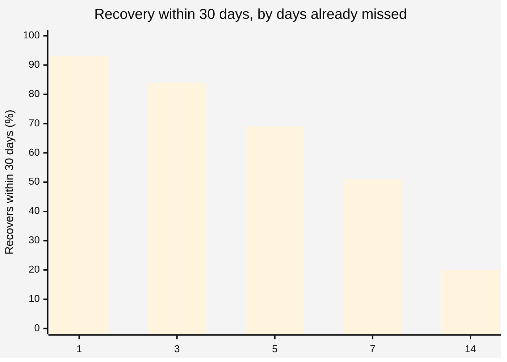
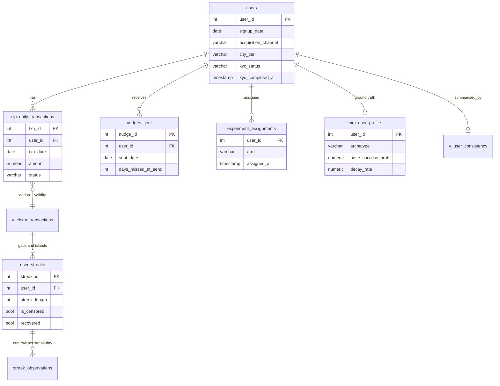
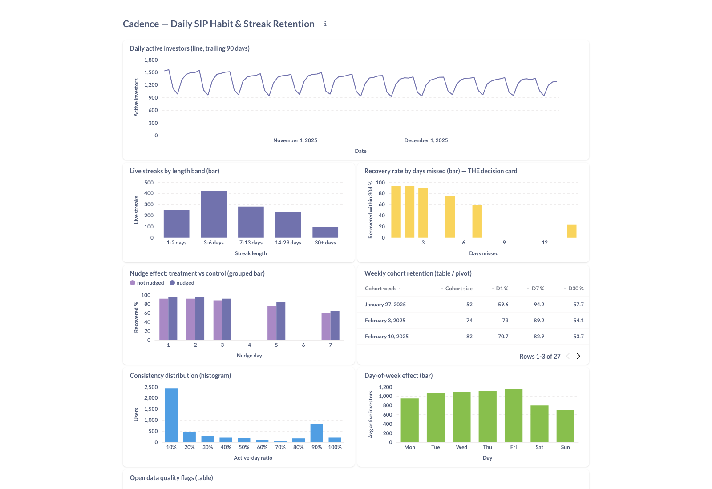

<div align="center">

# Cadence

**Daily SIP habit and streak retention engine**

Turns raw daily investment transactions into streak health signals, finds where and why habits break, and tests whether a nudge actually changes the outcome.

[](https://github.com/Navneet-Scaler/cadence/actions/workflows/ci.yml)
[](https://github.com/Navneet-Scaler/cadence/releases)
[](https://www.python.org/)
[](https://www.postgresql.org/)
[](LICENSE)

**[View Live Findings →](https://navneet-scaler.github.io/cadence/)**
&nbsp;·&nbsp;
[Read the Memo](MEMO.md)
&nbsp;·&nbsp;
[See the Dashboard](#the-dashboard)
&nbsp;·&nbsp;
[Quickstart](#quickstart)

</div>

<br>

> **The data is simulated.** The pipeline, statistics, and tests are real and run
> unchanged against production. The numbers below demonstrate that this method
> can locate an answer, not a claim about any real user base. Full disclosure
> in [ASSUMPTIONS.md](ASSUMPTIONS.md).

## Table of contents

- [Why this exists](#why-this-exists)
- [The answer](#the-answer)
- [Schema](#schema)
- [Quickstart](#quickstart)
- [How it works](#how-it-works)
- [The dashboard](#the-dashboard)
- [Findings](#findings)
- [Repository layout](#repository-layout)
- [Stack](#stack)
- [Engineering notes](#engineering-notes)

## Why this exists

Most fintech retention frameworks are built for **monthly** behaviour: monthly
SIPs, monthly billing, monthly cohorts. A product built on investing ₹21
*every day* has a completely different failure mode, and the monthly toolkit
hides it.

| | Monthly SIP | Daily SIP |
|---|---|---|
| Missed one payment | Might still be fine, the next one is 30 days away | Already a churn signal |
| Retention question | Did they stay subscribed | Did the habit survive the first gap |
| Where the analysis lives | Account status | Time between successful days |

The whole retention problem lives in the gap between "missed once" and "gone for
good." Cadence measures that gap end to end: schema, simulation, streak
construction, survival analysis, a randomised nudge experiment, and a live
dashboard.

## The answer

**Nudge on day 5 of a lapse, not day 1.**



Between day 3 and day 7 the odds of losing someone **triple**. A nudge fired on
day 5 lifts 30-day recovery by **+7.7 percentage points** (95% CI [5.70, 9.75])
and needs **13 sends per recovered user**, against 26 to 27 sends on every other
trigger day. Two independent methods, a Kaplan-Meier recovery curve and a
randomised experiment, locate day 5 from separate arithmetic.

**[Read the full one-page memo →](MEMO.md)**

## Schema



Layered by meaning. Production-shaped tables are the source of truth, derived
tables (`user_streaks`, `streak_observations`) are safe to truncate and
rebuild, and `sim_user_profile` holds simulation ground truth in its own table
so it can never be mistaken for an observed field.

## Quickstart

Needs Docker and Python 3.12 (installed automatically via [uv](https://docs.astral.sh/uv/) if missing).

```bash
git clone https://github.com/Navneet-Scaler/cadence.git && cd cadence
cp .env.example .env               # fill in DB credentials

make setup                         # venv, pinned deps, pre-commit hooks
make db-up                         # postgres:16 in Docker
make schema                        # apply the DDL
make run-sim                       # generate + load 373k transactions (~8s)
make all                           # streaks, survival, cohorts, nudge, quality, report
```

Then, to see the results:

```bash
make dashboard                     # provisions Metabase at localhost:3001
make notebook                      # or open notebooks/streak_analysis.ipynb
```

Run `make help` for every command. A full pipeline run from empty database to
finished report takes under a minute.

## How it works

### Streaks: the gaps-and-islands problem

```sql
txn_date - ROW_NUMBER() OVER (PARTITION BY user_id ORDER BY txn_date)
```

Inside an unbroken run, both sides of that subtraction increment by 1 each day,
so the difference stays constant. That constant *is* the streak's identity.
One pass, no self-join.

The same logic is implemented twice: in SQL for production, and in pandas for
testability. [`validate_against_sql`](src/analysis/streak_builder.py) asserts
they agree on all **50,576 streaks**, and that check now runs in CI's
`db-tests` job on every push, not just by hand. A streak definition that
drifts between the dashboard and the notebook is how two teams end up quoting
different numbers off the same warehouse. Here, drift is a test failure.

### Survival analysis: censoring is the whole point

A streak still running when the data ends has **not** died. Treating it as
dead biases every estimate downward. Likewise, "hasn't come back yet" is not
"never came back": a user who lapsed three days before the window closed
never had a chance to return.

Conditional recovery is read off a fitted Kaplan-Meier curve:

```
P(returns | already missed k days) = 1 - S(horizon) / S(k)
```

The complement is named `p_no_return_within_horizon`, deliberately not "never
returns." A finite observation window cannot support the word *never*.

### Cox model: clustered, because streaks recur

50,576 streaks come from 5,000 users. Treating them as independent inflates
the effective sample size roughly tenfold and shrinks every standard error to
match. Clustering on `user_id` changed the conclusions: two covariates that
looked significant before clustering turned out to be artifacts of that
assumption.

### The nudge experiment: matched on the risk set

Each treated break is compared only against control breaks that also reached
the **same gap length unrecovered**. A user who returned on day 1 was never
reachable by a day-3 nudge and does not belong in that denominator. Five
thresholds tested, Holm-Bonferroni corrected.

## The dashboard



Eight cards, provisioned end to end from version-controlled SQL rather than
clicked together in the Metabase UI, so the dashboard cannot silently drift
from the analysis. Full-height screenshot and every card's query in
[`dashboards/metabase_notes.md`](dashboards/metabase_notes.md) and
[`sql/dashboard_questions.sql`](sql/dashboard_questions.sql).

```bash
make dashboard   # rebuilds this exact instance in about 90 seconds
```

## Findings

**Recovery collapses between day 3 and day 7.** 84% to 51%. Day 5 is the
inflection, confirmed independently by the survival curve and the experiment.

**Consistency is bimodal, not a bell curve.** 2,435 users invest on under 10%
of their days, 1,041 on over 90%, almost nobody in between. The 30% average
describes essentially no real user, so any goal framed as "raise average
consistency" is aiming at a gap in the distribution. This was not something
the analysis went looking for.

**A user's first streak is the fragile one.** It breaks about 18% faster than
the same user's later streaks (hazard ratio 1.18, p < 0.001), controlling for
channel, city tier, and KYC speed. Habit formation gets easier the second
time.

**Weekends cost 39% of daily activity.** Friday averages 1,145 active
investors, Sunday 696.

**Acquisition channel does not predict retention.** Neither does city tier.
The Cox model reports these as non-significant rather than hiding them: a
null result is still a finding.

**Conventional retention framing flatters D30 by 19 points.** The standard
account-based definition reads 55%. Measured against the actual daily
promise, actually invested that day, it is 36%.

## Repository layout

| Path | What it is |
|---|---|
| [`sql/schema.sql`](sql/schema.sql) | Schema, commented table by table |
| [`sql/streak_construction.sql`](sql/streak_construction.sql) | Gaps-and-islands streak builder |
| [`sql/dashboard_questions.sql`](sql/dashboard_questions.sql) | All 8 dashboard cards |
| [`src/simulate/`](src/simulate/) | Behavioural data generator |
| [`src/analysis/`](src/analysis/) | Streaks, survival, cohorts, nudge, data quality |
| [`src/reporting/`](src/reporting/) | Scheduled weekly report |
| [`scripts/`](scripts/) | Cron wrapper, Metabase provisioning |
| [`tests/`](tests/) | 101 unit tests + 1 DB-backed integration test |
| [`notebooks/`](notebooks/streak_analysis.ipynb) | Narrative walkthrough, imports from `src/` |
| [`MEMO.md`](MEMO.md) | The one-page decision memo |
| [`ASSUMPTIONS.md`](ASSUMPTIONS.md) | What is real versus what is modelled |
| [`data_quality_findings.md`](data_quality_findings.md) | 6 findings with fix DDL |
| [`dashboards/metabase_notes.md`](dashboards/metabase_notes.md) | Dashboard setup and screenshot |

## Stack

<div>


</div>

PostgreSQL 16 · Python 3.12 · pandas · lifelines · scipy · statsmodels ·
matplotlib · Metabase · Docker · pytest · GitHub Actions

## Engineering notes

- **No generated data in git.** The generator is the artifact. Data is
  regenerable from a fixed seed, byte for byte, with a test asserting it.
- **No credentials in source.** All configuration comes from the environment.
  `.gitignore` landed in the first commit, before anything else was staged.
- **Reseeding is explicit.** `TRUNCATE ... RESTART IDENTITY CASCADE` would
  orphan any downstream foreign key, so it requires `--reseed` and never
  happens as a side effect of a normal run.
- **CI runs two jobs.** `quality` covers formatting, linting, and the
  database-free test suite. `db-tests` brings up Postgres, applies the
  schema, seeds data, and runs the SQL/pandas streak-parity check for real.
- **Every chart carries numbers**, and non-significant results are drawn
  rather than dropped.

---

<div align="center">

Built end to end from schema to decision memo.
[GitHub](https://github.com/Navneet-Scaler/cadence) · [Releases](https://github.com/Navneet-Scaler/cadence/releases) · [Live Findings](https://navneet-scaler.github.io/cadence/)

</div>
