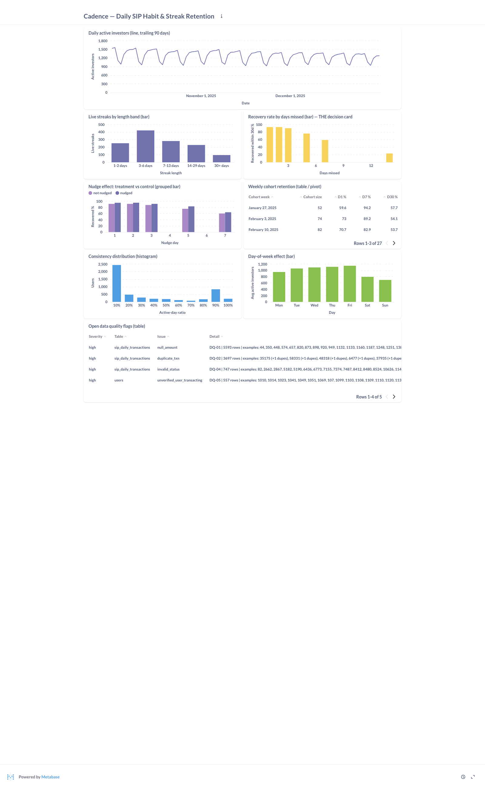

# Metabase Dashboard

The dashboard the growth team is meant to open every morning: **Cadence — Daily
SIP Habit & Streak Retention**, eight cards, built from the same views the Python
analysis reads.

## Reproducible, not clicked together

Metabase stores questions and dashboards in its own application database. That
means a card built in the UI is **not version controlled** — it can't be
reviewed, diffed, or restored after someone edits it, and it silently drifts
from the analysis it's supposed to mirror.

So the dashboard here is provisioned from code:

- `sql/dashboard_questions.sql` — every card as a runnable query, with comments
  explaining what decision it supports.
- `scripts/provision_metabase.py` — parses that file and builds the connection,
  the cards, and the dashboard layout through the Metabase API.

The script **parses the SQL file rather than duplicating the queries**, so there
is exactly one copy of each and the dashboard cannot drift from the committed
definition. It's idempotent: re-running updates the existing cards instead of
creating a second set.

## Setup

```bash
# 1. Postgres must be up with data loaded
make db-up && make schema && make run-sim && make streak

# 2. Metabase needs its own application database, once
docker compose exec -T postgres psql -U cadence_user -d postgres \
    -c "CREATE DATABASE metabase_app"

# 3. Start Metabase (first boot takes ~30s to run its migrations)
make metabase-up

# 4. Set an admin password in .env, then provision
#    METABASE_ADMIN_EMAIL=admin@example.com
#    METABASE_ADMIN_PASSWORD=your-password-min-8-chars
make dashboard
```

Then open **http://localhost:3001** and sign in with those credentials.

### Two things that will bite you

**The database host is `postgres`, not `localhost`.** Metabase runs in the same
Docker network as the database, so it connects to the *service name* on the
container's internal port **5432** — not the host-side port. Entering
`localhost:5433` (which is what works from your laptop) gives a connection
refused that looks like a credentials problem and isn't. The provisioning script
sets this correctly via `METABASE_DB_HOST` / `METABASE_DB_PORT`.

**Metabase is on host port 3001, not the usual 3000.** Port 3000 was already in
use on the development machine, so the compose file maps `3001:3000`. Override
with `METABASE_PORT` in `.env` if 3001 is also taken.

## The eight cards

| # | Card | Type | What decision it supports |
|---|---|---|---|
| 1 | Daily active investors | line | Top-line habit metric. Everything else explains a move here. |
| 2 | Live streaks by length band | bar | How many people currently hold a habit, and how deep. |
| 3 | **Recovery rate by days missed** | bar | **The decision card** — where the intervention day comes from. |
| 4 | Nudge effect: treatment vs control | bar | Whether the intervention actually works, per trigger day. |
| 5 | Weekly cohort retention | table | Whether newer cohorts behave better than older ones. |
| 6 | Consistency distribution | bar | Shape of the user base by active-day ratio. |
| 7 | Day-of-week effect | bar | Weekend softness, for timing campaigns. |
| 8 | Open data quality flags | table | Governance next to the metrics it affects. |

Card 8 is on the same dashboard on purpose: a number nobody trusts should be
visible next to the reason not to trust it, rather than buried in a separate
"data health" page nobody opens.

## What the dashboard currently shows

Verified against the live instance (5,000 users, 373,387 transactions):

**Card 3 — recovery by days missed.** 93% recover after 1 day missed, 84% after
3, 69% after 5, 51% after 7. The collapse between day 3 and day 7 is the entire
retention problem in one card.

**Card 6 — consistency is bimodal, not a bell curve.** 2,435 users sit in the
bottom 10% active-day ratio, while 1,041 sit above 90%. There is no meaningful
middle. This was not something the analysis went looking for, and it changes the
framing: the product isn't converting a broad population of moderate investors,
it's producing two distinct populations, and the interesting question is what
moves someone from the left cluster to the right one.

**Card 7 — day-of-week effect.** Friday averages 1,145 active investors against
Sunday's 696, a 39% weekend drop. Any campaign measured Monday-to-Monday will
read very differently from one measured Thursday-to-Thursday.

## Screenshot



Captured headlessly from a live, freshly-provisioned instance (temporary public
link, revoked immediately after) — not a mockup, not a description of intent.

Taking this screenshot caught a real bug: cards 3, 4, 6, and 7 initially
rendered as an unconfigured "which fields do you want to use for the X and Y
axes?" prompt instead of a chart. Native SQL questions have no GUI-built query
for Metabase to infer axes from, so `upsert_card` in
[`scripts/provision_metabase.py`](../scripts/provision_metabase.py) now sets
`visualization_settings` (`graph.dimensions` / `graph.metrics`) explicitly per
card, keyed off the column names each query returns. Confirmed by re-running the
provisioning script and re-capturing — every card renders a chart, not a picker.

The dashboard is also verified programmatically: the provisioning script
confirms all eight cards were created and each returns rows (card 1: 91 rows,
card 6: 10 rows, card 7: 7 rows). `make dashboard` rebuilds this exact instance
from `sql/dashboard_questions.sql` on any machine in about 90 seconds — run it
and look at the real thing, rather than trusting a screenshot from one point in
time.
